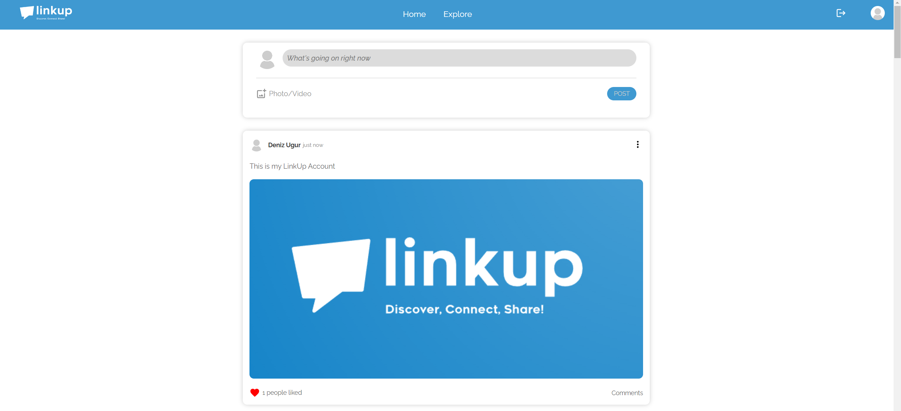

# 🔔 LinkUp Project

**Social Media Application**
**by Simon Streuli**

LinkUp is a simple social media app that allows users to connect with each other, share content, and build friendships. It provides a platform for users to customize their profiles, post updates, and interact with others.


## ⚙️ Prerequisites

Before you can run LinkUp, you will need the following tools installed on your system:

- [Node.js](https://nodejs.org.) (LTS Version)
- [MongoDB](https://www.mongodb.com/cloud) (Create own Database to run LinkUp)
- [Yarn or NPM](https://yarnpkg.com)

## 🚀Setup

To run LinkUp you need to follow the following steps:

1. Clone the Repository to your machine and navigate to the repository:

   ```sh
   git clone https://github.com/simonstreuli/Abschlussprojekt
   cd Abschlussprojekt

   ```

2. Install the required dependencies for the backend by running the following command:

   ```sh
   cd backend
   npm install
   ```

3. Create .env File and provide the Database connection with the URL of your database:

   ```sh
   MONGO_URL=mongodb+srv://<user>:<password>@cluster0.phhwfao.mongodb.net/?retryWrites=true&w=majority
   ```

4. Run the backend with the following command:

   ```sh
   npm start run
   ```

5. Split terminal, navigate to the frontend and install required dependencies:
   ```sh
   cd ../frontend
   npm install
   ```
6. Run the frontend with the following command:
   ```sh
   npm run start
   ```
7. Open the app in your browser at http://localhost:3000

## 🔑License

This project is protected by copyright and is subject to the corresponding rights.
